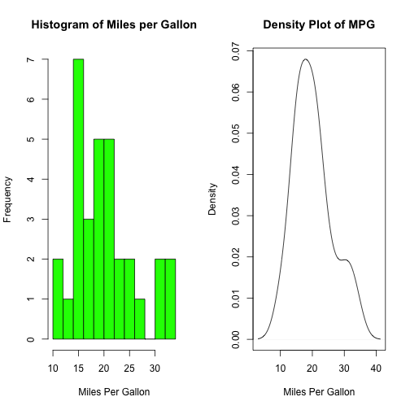
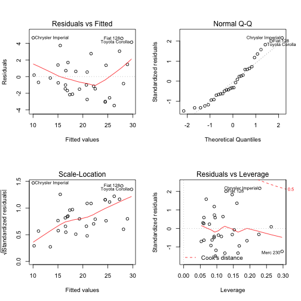

Regression Models: Peer Assessment 1
----------------------------------------

##  Executive Summary

The data set given in 'mtcars', linear regression model calculations has been made using correlation, significant linear regression, Multivariate regression analysis coefficients and predictor variance analysis is used to solve the following two questions:

* “Is an automatic or manual transmission better for MPG”
*  “Quantifying how different is the MPG between automatic and manual transmissions?”

### Visible settings

```r
echo = TRUE
options(scipen = 1)
```

# Data Processing
Data was obtained in R CRAN and its documentation can be found on : http://stat.ethz.ch/R-manual/R-devel/library/datasets/html/mtcars.html

## Load and Test Data


```r
library(datasets)
mpgData <- with(mtcars, data.frame(mpg, am))
mpgData$am <- factor(mpgData$am, labels = c("Automatic", "Manual"))
summary(mpgData)
```

```
##       mpg                am    
##  Min.   :10.40   Automatic:19  
##  1st Qu.:15.43   Manual   :13  
##  Median :19.20                 
##  Mean   :20.09                 
##  3rd Qu.:22.80                 
##  Max.   :33.90
```

Based on the results, number of cylinders, displacement, and weight have the strongest correlations with MPG.

# Exploratory Data Analysis

## Predictors Variance Analysis


```r
summary(aov(mpg ~ ., data=mtcars))
```

```
##             Df Sum Sq Mean Sq F value   Pr(>F)    
## cyl          1  817.7   817.7 116.425 5.03e-10 ***
## disp         1   37.6    37.6   5.353  0.03091 *  
## hp           1    9.4     9.4   1.334  0.26103    
## drat         1   16.5    16.5   2.345  0.14064    
## wt           1   77.5    77.5  11.031  0.00324 ** 
## qsec         1    3.9     3.9   0.562  0.46166    
## vs           1    0.1     0.1   0.018  0.89317    
## am           1   14.5    14.5   2.061  0.16586    
## gear         1    1.0     1.0   0.138  0.71365    
## carb         1    0.4     0.4   0.058  0.81218    
## Residuals   21  147.5     7.0                     
## ---
## Signif. codes:  0 '***' 0.001 '**' 0.01 '*' 0.05 '.' 0.1 ' ' 1
```
The predictors variance relates to MPG further identifies engine configuration as relatively least significant regressor.  After removing it and reassessing the model, all these predictors became significant.  

## Correlation analysis
Let's check the correlation between mpg and other variables by using the cor() function

```r
data(mtcars)
sort(cor(mtcars)[1,])
```

```
##         wt        cyl       disp         hp       carb       qsec 
## -0.8676594 -0.8521620 -0.8475514 -0.7761684 -0.5509251  0.4186840 
##       gear         am         vs       drat        mpg 
##  0.4802848  0.5998324  0.6640389  0.6811719  1.0000000
```
From the correlation data, we could see cyl, hp, wt and carb are negatively correlated with mpg. In addition to am, we observed that wt, cyl, disp, and hp are highly correlated with our dependent variable mpg.

# Modeling Procedures

## Simple Linear Regression


```r
LRM1 <- lm(mtcars$mpg ~ cyl + disp + wt, data=subset(mtcars, select=c(mpg, cyl, disp, wt)))
summary(LRM1)$coefficients
```

```
##                 Estimate Std. Error    t value     Pr(>|t|)
## (Intercept) 41.107677641 2.84242604 14.4621802 1.620381e-14
## cyl         -1.784943519 0.60711048 -2.9400638 6.511676e-03
## disp         0.007472925 0.01184472  0.6309079 5.332173e-01
## wt          -3.635677016 1.04013753 -3.4953811 1.595519e-03
```

With this model, disp becomes insignificant once again, therefore we reduce the data again to reevaluate:

## Multivariate regression analysis


```r
LRM2 = step(lm(data = mtcars, mpg ~ .),trace=0,steps=10000)
summary(LRM2)
```

```
## 
## Call:
## lm(formula = mpg ~ wt + qsec + am, data = mtcars)
## 
## Residuals:
##     Min      1Q  Median      3Q     Max 
## -3.4811 -1.5555 -0.7257  1.4110  4.6610 
## 
## Coefficients:
##             Estimate Std. Error t value Pr(>|t|)    
## (Intercept)   9.6178     6.9596   1.382 0.177915    
## wt           -3.9165     0.7112  -5.507 6.95e-06 ***
## qsec          1.2259     0.2887   4.247 0.000216 ***
## am            2.9358     1.4109   2.081 0.046716 *  
## ---
## Signif. codes:  0 '***' 0.001 '**' 0.01 '*' 0.05 '.' 0.1 ' ' 1
## 
## Residual standard error: 2.459 on 28 degrees of freedom
## Multiple R-squared:  0.8497,	Adjusted R-squared:  0.8336 
## F-statistic: 52.75 on 3 and 28 DF,  p-value: 1.21e-11
```
This shows that in adddition to transmission, weight of the vehicle as well as accelaration speed have the highest relation to explaining the variation in mpg. The adjusted R-squared is 84% which means that the model explains 84% of the variation in mpg indicating it is a robust and highly predictive model.

## Final model to quantify mpg difference between automatic and manual transmissions

### We include 3 variables wt, qsec and am.

```r
LRM3 <- lm(mpg~am + wt + qsec, data = mtcars)
anova(LRM1, LRM3)
```

```
## Warning in anova.lmlist(object, ...): models with response '"mpg"' removed
## because response differs from model 1
```

```
## Analysis of Variance Table
## 
## Response: mtcars$mpg
##           Df Sum Sq Mean Sq  F value    Pr(>F)    
## cyl        1 817.71  817.71 121.4689 1.078e-11 ***
## disp       1  37.59   37.59   5.5845  0.025299 *  
## wt         1  82.25   82.25  12.2177  0.001596 ** 
## Residuals 28 188.49    6.73                       
## ---
## Signif. codes:  0 '***' 0.001 '**' 0.01 '*' 0.05 '.' 0.1 ' ' 1
```
This model captured 84% of the overall variation in mpg. With a p-value of 3.745e-09, we reject the null hypothesis and claim that our multivariate model is significantly different from our simple linear regression model.

Therefore given the above analysis, the question of auto car and manual car is not anwsered and have to be considered in the context of weight and accelaration speed.

It is also important to check the residuals for any signs of non-normality and examine the residuals vs. fitted values plot to spot for any signs of heteroskedasticity.The residual diagnostocs show normality and no evidence of heteroskedasticity (Appendix 2).

### Q1: Is an automatic or manual transmission better for MPG?


```r
summary(mpgData[mpgData$am == "Automatic",])
```

```
##       mpg                am    
##  Min.   :10.40   Automatic:19  
##  1st Qu.:14.95   Manual   : 0  
##  Median :17.30                 
##  Mean   :17.15                 
##  3rd Qu.:19.20                 
##  Max.   :24.40
```

```r
summary(mpgData[mpgData$am == "Manual",])
```

```
##       mpg                am    
##  Min.   :15.00   Automatic: 0  
##  1st Qu.:21.00   Manual   :13  
##  Median :22.80                 
##  Mean   :24.39                 
##  3rd Qu.:30.40                 
##  Max.   :33.90
```

### Q2: Quantify the MPG difference between automatic and manual transmissions?


```r
LRM4 <- lm(mpg ~ as.integer(am), data=mpgData)
summary(LRM2)
```

```
## 
## Call:
## lm(formula = mpg ~ wt + qsec + am, data = mtcars)
## 
## Residuals:
##     Min      1Q  Median      3Q     Max 
## -3.4811 -1.5555 -0.7257  1.4110  4.6610 
## 
## Coefficients:
##             Estimate Std. Error t value Pr(>|t|)    
## (Intercept)   9.6178     6.9596   1.382 0.177915    
## wt           -3.9165     0.7112  -5.507 6.95e-06 ***
## qsec          1.2259     0.2887   4.247 0.000216 ***
## am            2.9358     1.4109   2.081 0.046716 *  
## ---
## Signif. codes:  0 '***' 0.001 '**' 0.01 '*' 0.05 '.' 0.1 ' ' 1
## 
## Residual standard error: 2.459 on 28 degrees of freedom
## Multiple R-squared:  0.8497,	Adjusted R-squared:  0.8336 
## F-statistic: 52.75 on 3 and 28 DF,  p-value: 1.21e-11
```

### Results
So, manual transmission is better than automatic for MPG, which increased by 2.9358372.

# Appendix

## Appendix 1 : Let’s plot the dependent variable mpg to check its distribution.

```r
par(mfrow = c(1, 2))
# Histogram with Normal Curve
hist(mpgData$mpg, breaks=12, xlab="Miles Per Gallon", main="Histogram of Miles per Gallon", col="green")

# Kernel Density Plot
d <- density(mpgData$mpg)
plot(d, xlab = "Miles Per Gallon", main ="Density Plot of MPG")
```

 

## Appendix 2 : Residual diagnostics for final multivariate model

```r
par(mfrow = c(2,2))
plot(LRM3)
```

 
